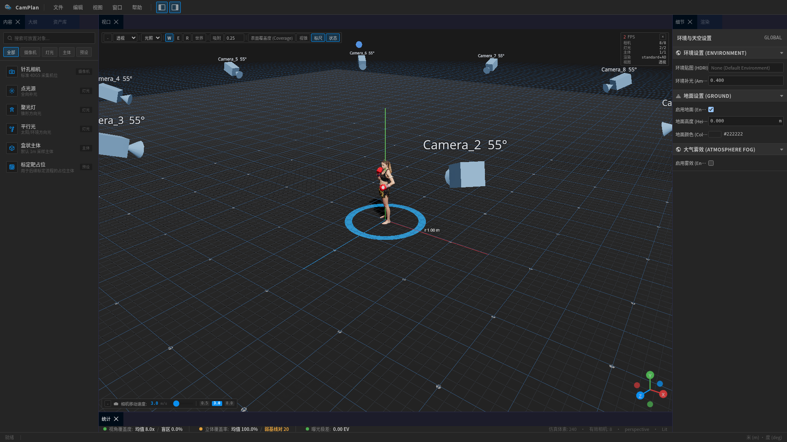
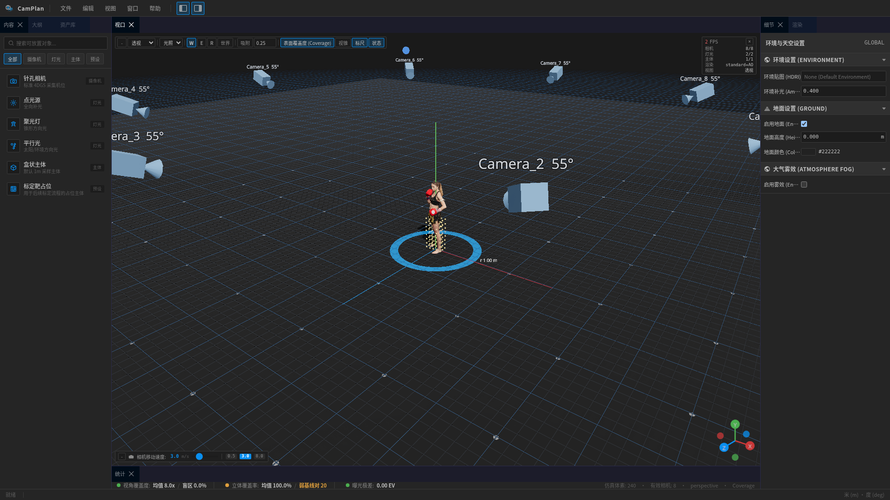
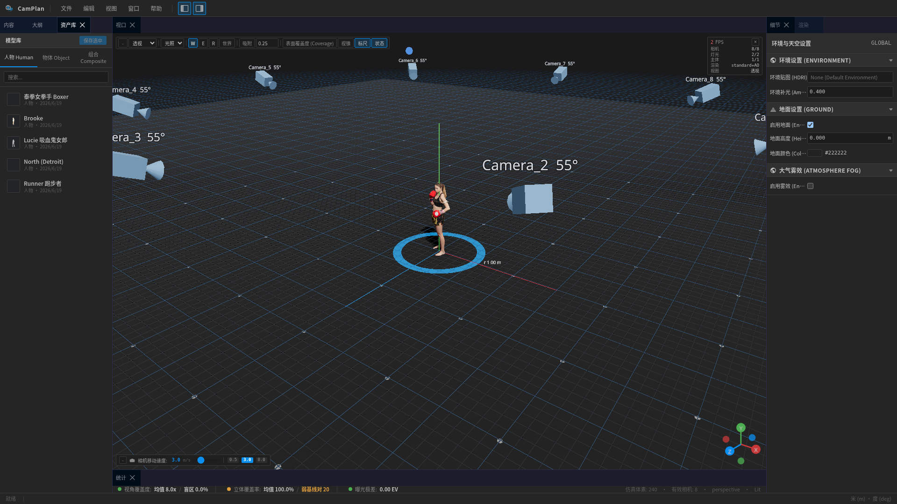
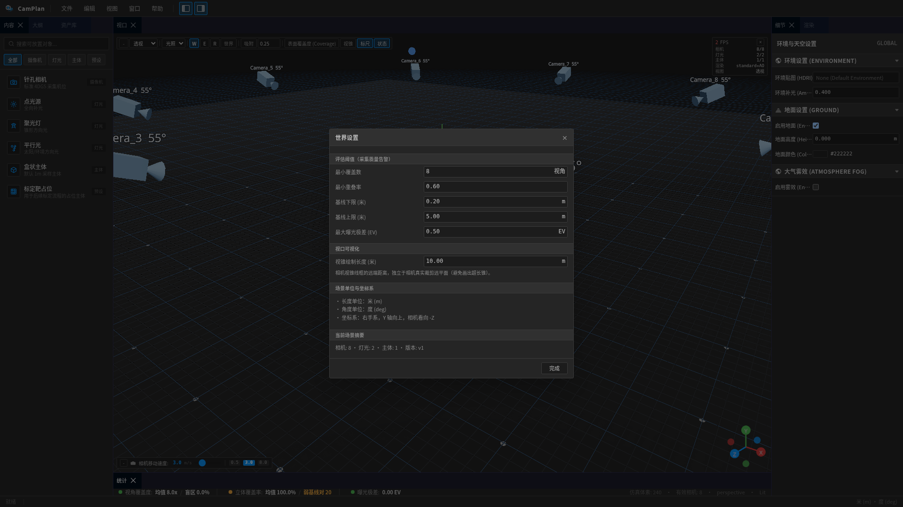
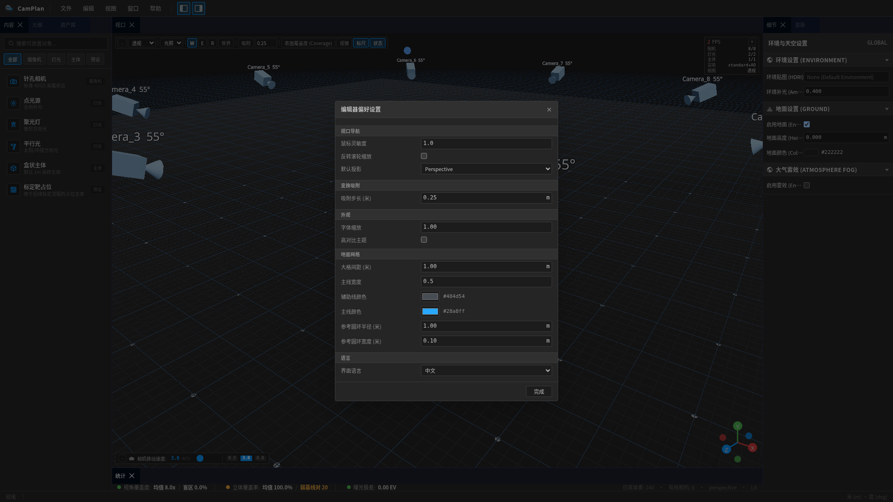

# CamPlan — 4DGS 拍摄规划仿真器

> 🎬 **Web 端相机机位规划、灯光布置与覆盖度评估工具**  
> 在 3D 场景中拖放摄像机阵列、灯光、环境与被拍主体，实时评估视锥、覆盖热图、盲区、重叠率与曝光一致性，并导出 Nerfstudio `transforms.json` / COLMAP 三件套，用于指导 4D/3D 高斯泼溅（4DGS/3DGS）等多视角采集工作。

---

## 目录

- [功能总览](#功能总览)
- [技术栈](#技术栈)
- [快速开始](#快速开始)
- [质量门禁](#质量门禁)
- [UI 与交互](#ui与交互)
- [仿真核心](#仿真核心)
- [导出与序列化](#导出与序列化)
- [高质量渲染](#高质量渲染)
- [资源库与资产](#资源库与资产)
- [项目文档](#项目文档)
- [截图展示](#截图展示)

---

## 功能总览

CamPlan 是一个**专业级 3D 拍摄规划编辑器**，严格参考 **Unreal Editor 5.8** 的暗色主题与交互范式，提供从场景搭建到数据采集导出的完整闭环。

### 🏗️ 场景编辑

| 功能 | 描述 |
|------|------|
| **拖放创建** | 从左侧 Content Browser 拖拽相机、灯光、主体到 3D 视口，自动落点于地面 raycast 命中位置 |
| **选择系统** | 单击单选 / Ctrl+单击多选 / Shift+范围选择；Outliner 与视口双向同步 |
| **Transform Gizmo** | W(平移)/E(旋转)/R(缩放) 切换，世界/局部坐标系切换，吸附步长可调 |
| **撤销/重做** | 快照式历史栈，gizmo 拖动节流入栈（避免高频撑爆），Ctrl+Z / Ctrl+Y |
| **聚焦与导航** | `F` 聚焦选中实体，`Home` 复位视口；Alt/Shift+1~9 书签；右键旋转/中键平移/滚轮缩放 |
| **多选编辑** | Details 面板支持多选聚合显示，Mixed Value 用 `—` 占位 |
| **层级管理** | Outliner 支持拖拽改父级（保持世界变换）、右键菜单、类型过滤、搜索、双击重命名 |
| **组对象编辑** | 组合资产（摄像机组）可进入单独编辑模式，编辑内部相机/灯光/主体，退出后整体可移动/复制/保存 |

### 📹 摄像机与采集

| 功能 | 描述 |
|------|------|
| **视锥可视化** | 每台相机实时显示透视视锥线框；选中时高亮（蓝色），支持开关显示 |
| **相机参数** | 焦距、FOV、分辨率、曝光（ISO/快门/光圈）、近远裁剪面 |
| **相机阵列预设** | 内置环形(8/360°)、半球、线性、矩阵等常见 4DGS 采集阵列，一键拖入 |
| **相机预览** | Details 面板嵌入实时预览小窗，从该相机视角渲染场景 |
| **视锥始终显示** | 选中摄像机的视锥始终可见，颜色 `#0a8fef`、透明度 0.9 |

### 💡 灯光与环境

| 功能 | 描述 |
|------|------|
| **灯光类型** | 点光源、聚光灯、方向光、区域光，支持范围/锥角/强度/颜色/阴影 |
| **HDRI 环境** | 4 套 HDR 预设，PMREM 环境光照，支持阴影接收 |
| **软阴影** | 启用 `castShadow` + `shadowMap='soft'`，真实感光照 |
| **光照均匀性评估** | `lightMeter` 评估均匀性/过曝/欠曝，RenderSettingsPanel 只读展示 |

### 🎯 覆盖度评估

| 功能 | 描述 |
|------|------|
| **覆盖热图** | 按 Space 切换，主体表面采样点按覆盖相机数着色：蓝→绿→黄→红 |
| **盲区检测** | 红色标记盲区，StatsBar 实时显示盲区占比 |
| **重叠率** | Jaccard 两两重叠矩阵，平均重叠率与弱基线对计数 |
| **Baseline** | 相邻相机世界距离，评估采集基线是否充足 |
| **曝光一致性** | 计算 EV 极差与标准差，超阈值告警 |
| **阈值可配置** | World Settings 面板可编辑覆盖/重叠/baseline/曝光阈值 |
| **性能优化** | `useDeferredValue` debounce 计算，grid=16（~4096 采样点），避免拖动卡顿 |

### 🖼️ 视口与可视化

| 功能 | 描述 |
|------|------|
| **视图模式** | Lit / Wireframe / Bounds 三模式切换 |
| **投影切换** | Perspective / Top / Front / Side（当前为透视位置模拟） |
| **覆盖热图** | 5 级色阶点云叠加，Space 键切换 |
| **Bounds 叠加** | 显示所有主体 AABB 线框边界 |
| **辅助线** | 地面圆环带（TorusGeometry，半径 1m）、2m 格子点球阵、选中主体尺寸标注 |
| **网格优化** | 25 小格/大格，DoubleSide 修复锯齿 |
| **后处理栈** | Bloom + SSAO + 色调映射（ACES/AgX/Filmic/Linear），质量分级控制 |
| **粒子系统** | 自研 GLSL 软粒子（烟雾/火焰/尘埃等 5 种预设），GPU 实例化 |
| **Path Tracing** | `three-gpu-pathtracer` 骨架集成，渐进式高质量预览（浏览器实测待完善） |
| **FPS 计数器** | 视口左上角实时帧率显示 |
| **HUD** | 视口信息显示开关 |

### 📦 资源库与资产

| 功能 | 描述 |
|------|------|
| **内置模型库** | 人物（Boxer/Brooke/Lucie/North/Runner）、车辆（Aston Martin/Jeep）、设备（CNC）等 9 个 USDZ 模型 |
| **内置摄像机组** | 环形(8/360°)、半球、线性、矩阵 4 种组合预设 |
| **Library Browser** | 三标签（人物/物体/组合），搜索、缩略图预览、拖入场景 |
| **缩略图渲染** | 运行时 USDZ 无光照渲染（MeshBasicMaterial + 3x 提亮），精确 AABB 计算，包围球自动取景 |
| **保存为资产** | 选中对象一键保存为个人库资产，生成缩略图 |
| **IndexedDB 存储** | 本地库持久化，首次启动自动种子内置资源 |
| **资产许可** | 所有内置资源记录 source/author/license/hash，仅使用 CC0/可再分发资源 |

### 🎬 动画支持

| 功能 | 描述 |
|------|------|
| **USDZ 骨骼动画** | 支持 `SkinnedMesh` + `AnimationMixer`，运行时播放 |
| **骨骼层级修复** | 自动将嵌套在 `SkinnedMesh` 内的根骨骼解绑到正确父级 |
| **动画切换** | Details 面板下拉选择动画 clip（如 `idle`），支持多 clip 模型 |
| **默认动画** | 主体模型支持 `animate: true` 自动播放首个动画 |

### 📤 导出与序列化

| 功能 | 描述 |
|------|------|
| **transforms.json** | Nerfstudio / 4DGS 兼容格式，camera_to_world 4×4 + 内参，round-trip 自校验 |
| **COLMAP 三件套** | `cameras.txt`(PINHOLE) / `images.txt`(四元数+世界→相机平移) / `points3D.txt`(空占位) |
| **拍摄清单** | CSV/JSON 双格式，含位姿+曝光+触发时刻，按 time 升序 |
| **场景存盘** | `.planner.json` 整场景无损序列化，版本迁移支持，Save/Open/Save As |
| **自动保存** | 定时自动保存到 localStorage，崩溃恢复 |
| **截图导出** | 当前视口 PNG 截图（T-090） |
| **Contact Sheet** | 所有相机缩略图网格合成（T-089） |
| **渲染设置** | Draft/Standard/High/Ultra 质量预设，DPR/阴影/后处理/PT 上限联动 |

### 🎛️ 编辑器面板

| 面板 | 功能 |
|------|------|
| **MenuBar** | File/Edit/View/Window/Help 下拉菜单，导出/撤销/视口/布局/语言 |
| **Content Browser** | 左侧 Place Actors，分类搜索，拖拽创建实体 |
| **Outliner** | 层级大纲，眼睛显隐、搜索过滤、类型过滤、右键菜单、拖拽改父级 |
| **Viewport** | 3D 视口 + 左上工具条（投影/视图模式/热图/视锥/WER/坐标系/吸附） |
| **Details (Inspector)** | 属性面板，分类折叠，数值 scrub/双击编辑，三轴 Location/Rotation/Scale，多选 Mixed Value |
| **StatsBar** | 底栏实时评估：覆盖度/盲区/重叠/baseline/曝光，三色指示灯 + 阈值告警 |
| **Message Log** | 非阻塞日志面板，取代 alert/confirm |
| **Preferences** | 导航速度/鼠标灵敏度/滚轮反转/默认投影/吸附步长/字体缩放/语言 |
| **World Settings** | 评估阈值编辑器（覆盖/重叠/baseline/曝光） |
| **Render Settings** | 质量预设/色调映射/Bloom/SSAO/Path Tracing/截图导出/Contact Sheet |
| **Library Browser** | 资产库管理，搜索/预览/拖入/保存为资产 |

### 🌍 国际化

- **中英双语**：完整 i18n 系统，`zh` / `en` 一键切换（MenuBar → Help → Language）
- 所有面板、标签、提示、日志均支持双语

---

## 技术栈

| 维度 | 技术 |
|------|------|
| 渲染 | Three.js 0.184 + React Three Fiber 9.6 + @react-three/drei 10.7 |
| 状态 | Zustand 5.0（单一 store + 切片） |
| UI | React 19 + Tailwind CSS v4 + CSS 变量（UE5.8 Slate Dark 主题） |
| 布局 | Dockview 6.6（可停靠/标签/浮动/持久化） |
| 构建 | Vite 8 + TypeScript 6（strict） |
| 测试 | Vitest 4.1（221 tests, 26 files, 全绿） |
| 后处理 | @react-three/postprocessing + postprocessing |
| 路径追踪 | three-gpu-pathtracer + three-mesh-bvh |
| 虚拟列表 | @tanstack/react-virtual |
| 粒子 | 自研 GLSL（Three.js Points + 实例化） |

---

## 快速开始

```bash
# 安装依赖
npm install

# 启动开发服
npm run dev

# 生产构建（类型检查 + 打包）
npm run build
```

首次启动后，编辑器自动加载示例场景（环形 8 相机阵列 + 泰拳女拳手主体 + 三点布光），可直接开始编辑。

---

## 质量门禁

提交前必须三连通过：

```bash
npm run typecheck   # tsc -b --noEmit
npm run test        # Vitest（221 tests）
npm run lint        # ESLint
```

---

## UI 与交互

### 风格
- **严格参考 Unreal Editor 5.8**：Slate Dark 主题色板、紧凑高密度布局（行高 22px，字体 11-12px）、高对比度矢量图标
- **视口导航**：右键拖转视角（UE 的 LMB 不同，保留 LMB 给选择）、中键平移、滚轮缩放

### 快捷键

| 快捷键 | 功能 |
|--------|------|
| `W` / `E` / `R` | 切换 Gizmo 平移/旋转/缩放 |
| `Ctrl+Z` / `Ctrl+Y` | 撤销 / 重做 |
| `Delete` / `Backspace` | 删除全部选中实体 |
| `F` | 聚焦选中实体 |
| `Home` | 复位视口相机 |
| `Space` | 切换覆盖热图 |
| `1` / `2` / `3` / `4` | 透视 / 顶 / 前 / 侧视图 |
| `Alt+1~9` / `Shift+1~9` | 设置/跳转视口书签 |
| `Ctrl+D` | 复制选中实体 |

---

## 仿真核心

`sim/` 目录为纯 TypeScript，零 React/Three 依赖，可在 Node.js 中直接单元测试：

| 模块 | 功能 | 测试 |
|------|------|------|
| `frustum.ts` | 透视视锥数学（FOV/视图/投影/裁剪空间/点可见性） | 15 例 |
| `coverage.ts` | 主体 AABB 体积栅格采样 → 逐相机视锥判定 → 覆盖统计 | 10 例 |
| `overlap.ts` | Jaccard 两两重叠 + baseline 距离矩阵 | 7 例 |
| `exposure.ts` | EV 计算、极差、标准差、阈值判定 | 8 例 |
| `capture.ts` | 拍摄清单生成（位姿+曝光+时刻） | 6 例 |
| `lightMeter.ts` | 光照均匀性/过曝/欠曝评估 | — |
| `reconstructability.ts` | SfM 可重建性评估 | — |
| `surfaceSampling.ts` | 表面采样策略 | — |

---

## 导出与序列化

| 模块 | 格式 | 测试 |
|------|------|------|
| `transforms.ts` | Nerfstudio `transforms.json` | round-trip 4 例 |
| `colmap.ts` | COLMAP `cameras.txt` / `images.txt` / `points3D.txt` | round-trip 4 例 |
| `capture.ts` | CSV / JSON 拍摄清单 | 6 例 |
| `serialize.ts` | `.planner.json` 场景存盘 | round-trip 6 例 |
| `renderPreview.ts` | Contact Sheet PNG + 视口截图 | 10 例 |

---

## 高质量渲染

| 功能 | 状态 |
|------|------|
| PBR/glTF 导入 | ✅ `src/io/gltfImport.ts`（GLTFLoader + KTX2 + DRACO） |
| HDRI/IBL | ✅ 4 套 HDR 预设，PMREM 环境光照 |
| GI/软阴影 | ✅ `castShadow` + `shadowMap='soft'` |
| 色调映射 | ✅ ACES / AgX / Filmic / Linear |
| 后处理栈 | ✅ Bloom + SSAO + ToneMapping，质量分级 |
| Path Tracing | 🏗️ 骨架集成（`three-gpu-pathtracer`，浏览器实测待完善） |
| 粒子系统 | ✅ 自研 GLSL 软粒子，5 种预设 |
| 质量预设 | ✅ Draft/Standard/High/Ultra，联动 DPR/阴影/后处理/PT |
| 截图导出 | ✅ 视口 PNG + Contact Sheet |

---

## 资源库与资产

### 内置模型（9 个）

| 名称 | 类型 | 格式 | 动画 |
|------|------|------|------|
| 泰拳女拳手 Boxer | 人物 | USDZ | ✅ |
| Brooke | 人物 | USDZ | ✅ |
| Lucie | 人物 | USDZ | ✅ |
| North | 人物 | USDZ | ✅ |
| Runner | 人物 | USDZ | ✅ |
| Aston Martin | 车辆 | USDZ | — |
| Jeep | 车辆 | USDZ | — |
| Jeep 2007 | 车辆 | USDZ | — |
| CNC Machine | 设备 | USDZ | — |

### 内置摄像机组（4 种）

| 名称 | 描述 |
|------|------|
| 环形摄像机组 (8) | 8 相机 360° 环绕，半径 2.5m，高度 1.4m |
| 环形摄像机组 (360) | 高密度 360° 环绕 |
| 半球摄像机组 | 上半球覆盖阵列 |
| 线性摄像机组 | 线性排列阵列 |

---

## 项目文档

| 文档 | 内容 |
|------|------|
| [HANDBOOK.md](./HANDBOOK.md) | 项目上手手册 |
| [.coder-protocol.md](./.coder-protocol.md) | 多 AI coder 协作协议 |
| [PLAN.md](./PLAN.md) | V1 总体规划与里程碑（P0–P8） |
| [TASKS.md](./TASKS.md) | 任务看板（T-001 ~ T-094） |
| [LOG.md](./LOG.md) | 共享时间线日志 |
| [STATE.md](./STATE.md) | 当前世界状态 |
| [docs/architecture.md](./docs/architecture.md) | 架构与数据流 |
| [docs/notes/editor-bugs.md](./docs/notes/editor-bugs.md) | 编辑器 Bug 基线 |
| [docs/notes/ue5-editor-gap.md](./docs/notes/ue5-editor-gap.md) | UE5 能力差距矩阵 |
| [.agents/skills/](./.agents/skills/) | 5 个技能文档（4DGS/UE5-UI/交互/协作/规范） |

---

## 截图展示

> 以下截图展示 CamPlan 的核心界面与功能。所有截图来自实际运行中的 WebApp。

### 主界面 — 四区布局



> Dockview 四区布局：左侧 Content/Outliner、中间 3D 视口、右侧 Details、底栏 Stats。严格遵循 UE5.8 Slate Dark 主题。

### 3D 视口 — 环形相机阵列 + 主体


> 8 相机环形阵列环绕泰拳女拳手主体，视锥线框可视化，地面网格 + 圆环带 + 2m 格子点辅助线。

### 覆盖热图



> Space 键切换覆盖热图：主体表面采样点按覆盖相机数着色，蓝(低)→绿(中)→黄(高)→红(盲区)。

### Details 属性面板 — 相机参数 + 实时预览


> UE5 风格 Details 面板：分类折叠、数值 scrub、三轴输入、相机实时预览小窗、动画切换下拉。

### 底栏 Stats — 实时评估指标


> 实时显示覆盖度/盲区/重叠率/baseline/曝光极差，三色指示灯（绿/黄/红）+ 阈值告警。

### 渲染设置面板 — 质量预设 + 后处理


> Draft/Standard/High/Ultra 质量预设，色调映射、Bloom、SSAO、Path Tracing 参数、截图导出。

### 资源库 — 模型浏览与拖入



> Library Browser：人物/物体/组合三标签，缩略图预览，搜索过滤，拖入场景实例化。

### 世界设置 — 评估阈值配置



> 可配置覆盖度、重叠率、baseline、曝光阈值，驱动 StatsBar 告警与热图评估。

### 首选项 — 编辑器偏好



> 导航速度、鼠标灵敏度、滚轮反转、默认投影、吸附步长、字体缩放、语言切换。

### 导出 — transforms.json / COLMAP


> File 菜单一键导出 Nerfstudio transforms.json、COLMAP 三件套、拍摄清单 CSV。

---

## 架构铁律

1. **`sim/` 与 `export/` 纯 TS**：禁 React/Three 依赖，可在 Node.js 单测中直接运行
2. **Three 对象只在 `scene/`**：store 只存数据（`CameraDef`），视图层做数据→Three 映射
3. **单一 store**：Zustand 切片组合，undo/redo 对可序列化 `SceneDef` 做快照
4. **类型即契约**：`types/` 是各层公共语言，跨层只传这些类型
5. **角度单位**：度（存库/导出），弧度（内部 Three.js），换算只在 `lib/math`

---

## 状态

- **v1 主线（P0–P6）**：✅ 全部闭环 — 脚手架、仿真核心、3D 交互、专业 UI、导出序列化、端到端冒烟
- **UE5 编辑器可用性（P4.5）**：✅ 13 项任务完成
- **阶段2 高质量渲染（P7）**：✅ T-080~T-090 全部落地
- **阶段3 资源库（P8）**：🟣 当前进行中 — 内置资源、摄像机组、Library UI、组对象编辑

---

## License

本项目为私有项目，内部使用。内置模型资源均使用 CC0 或明确可再分发许可，详见 `public/library/index.json` 与各预设文件中的 `license` 字段。
